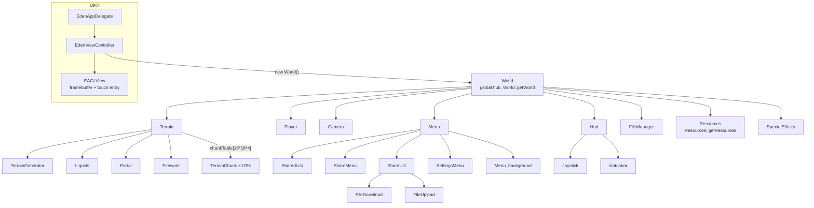
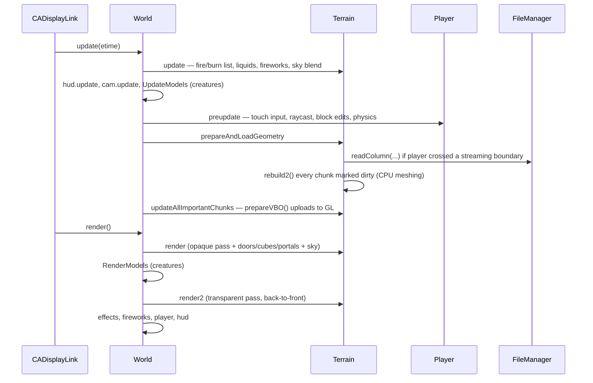

# Architecture Overview

Eden: World Builder is a voxel building game for iOS (2010–2014 era), written in
Objective-C++ against **OpenGL ES 1.1 (fixed-function)**. This repository is the 2.1.1
source release, lightly patched by the community to build in modern Xcode
(see `README.md`; fly-mode is enabled by default in this fork via `bool FLY_MODE=true;`
in `Classes/Player.mm:32`).

There is **no engine/game separation, no scene graph, and almost no abstraction layer**.
The game is a set of singletons wired together through raw pointers and `extern` globals.
Understanding the ownership graph below is 80% of understanding the codebase.

## Ownership graph

Everything reaches everything else through two static singletons:

- `World::getWorld` (a static **member pointer**, not a function — `World.h:56`)
- `Resources::getResources` (same pattern)

plus C-style globals for hot data: `blockarray` (block cache), `lightarray`,
`chunkTablec`, `g_offcx`/`g_offcz`, `colorTable[256]`, `blockinfo[]`, and the
`Input::getInput()` singleton.

## Major systems

| System | Files | One-line purpose |
|---|---|---|
| App shell / main loop | `main.m`, `EdenAppDelegate`, `EdenViewController`, `EAGLView` | CADisplayLink loop, GL context, touch entry ([execution-flow.md](execution-flow.md)) |
| World hub | `World.mm` | Game-mode state machine, per-frame update/render dispatch |
| Terrain | `Terrain.mm`, `TerrainChunk.mm` | Voxel storage, block edit ops, fire/TNT dynamics, chunk meshing, terrain rendering ([world-and-terrain.md](world-and-terrain.md), [rendering.md](rendering.md)) |
| Terrain generation | `TerrainGenerator.mm`, `TerrainGen2.mm`, `FileManagerHelper.mm` | Flat-world runtime gen; offline generator for the shipped default world `Eden.eden` ([terrain-generation.md](terrain-generation.md)) |
| Save/load | `FileManager.mm` | `.eden` world files, column streaming, format migration ([save-load.md](save-load.md), [eden-file-format.md](eden-file-format.md)) |
| Player/physics | `Player.mm`, `Camera.mm`, `Input.mm`, `Util.mm` | Touch processing, SAT polyhedra collision, movement, block pick raycast ([player-input-camera.md](player-input-camera.md)) |
| Creatures | `Model.mm` | Up to 300 animated creatures (PowerVR POD models), AI, save/restore ([entities-and-creatures.md](entities-and-creatures.md)) |
| Dynamics | `Liquids.mm`, root `Lighting.mm`, `Portal.mm`, `Firework.mm`, `Fire.mm`, `BlockBreak.mm`, `SpecialEffects.mm` | Water/lava flow, colored point lights, portals, particles ([lighting-liquids-effects.md](lighting-liquids-effects.md)) |
| UI | `Hud.mm`, `Menu.mm`, `SharedList.mm`, `ShareMenu.mm`, `SettingsMenu.mm`, `Joystick.mm`, `statusbar.mm`, `VKeyboard.mm`, `Alert.mm` | In-game HUD modes and the entire menu system, all custom GL rendering ([ui.md](ui.md)) |
| Networking | `ShareUtil.mm`, `FileUpload.mm`, `FileDownload.mm`, `edenweb/` | World sharing over HTTP to edengame.net ([networking.md](networking.md)) |
| Assets/audio | `Resources.mm`, `Texture2D.mm`, CocosDenshion | Texture atlases, sounds, ambient audio ([resources-and-audio.md](resources-and-audio.md)) |
| Third-party | `PVRT*`, `CC*`/`CD*`, `glu*`, `zpipe`, `md5`, `Appirater`, Flurry | See [third-party.md](third-party.md) |

## Data flow, one frame (game mode)

## The three big architectural ideas

1. **A sliding toroidal window over an "infinite" world.**
   Only an 18×18-chunk-column area (288×288×64 blocks) around the player is resident.
   World coordinates are absolute (the default world centre is at chunk 4096, block
   ~65,536); resident storage (`blockarray`, `chunkTable`) is indexed **modulo** the
   window size, so walking simply overwrites the far edge of the arrays with newly
   streamed columns — no memmove ever happens. See [world-and-terrain.md](world-and-terrain.md).

2. **Append-only save files with a directory at the end.**
   A `.eden` file is `header | column data | creatures | directory`. New columns are
   appended where the creatures block sits, and creatures + directory are rewritten
   after them. Only the directory pointer in the header moves. See
   [eden-file-format.md](eden-file-format.md).

3. **The shipped default world is itself a giant `.eden` file.**
   `TerrainGen2.mm` is an *offline* generator (run via the `JUST_TERRAIN_GEN` build
   flag) that produced the 2880×2880-block `Eden.eden` bundled with the app. At
   runtime, "generation" for the default world is mostly *streaming decompression*
   from that bundle. See [terrain-generation.md](terrain-generation.md).

## Engine vs. game code (summary)

Roughly 60% of the lines in `Classes/` are third-party or generic (PowerVR SDK,
CocosDenshion, Texture2D, a GLU port, hashmap, math/collision utilities). The
game-specific core is ~15k lines concentrated in Terrain/TerrainChunk/FileManager/
Player/Hud/Model/Menu. A concrete separation roadmap is in
[engine-vs-game.md](engine-vs-game.md).

## Reading order for new contributors

1. This file, then [conventions-and-pitfalls.md](conventions-and-pitfalls.md) — **do not
   skip**; the `(x, z, y)` argument convention alone will otherwise cost you a day.
2. [world-and-terrain.md](world-and-terrain.md) — the data model.
3. [execution-flow.md](execution-flow.md) — how a frame runs.
4. [eden-file-format.md](eden-file-format.md) + [save-load.md](save-load.md).
5. Whatever subsystem you're touching.
