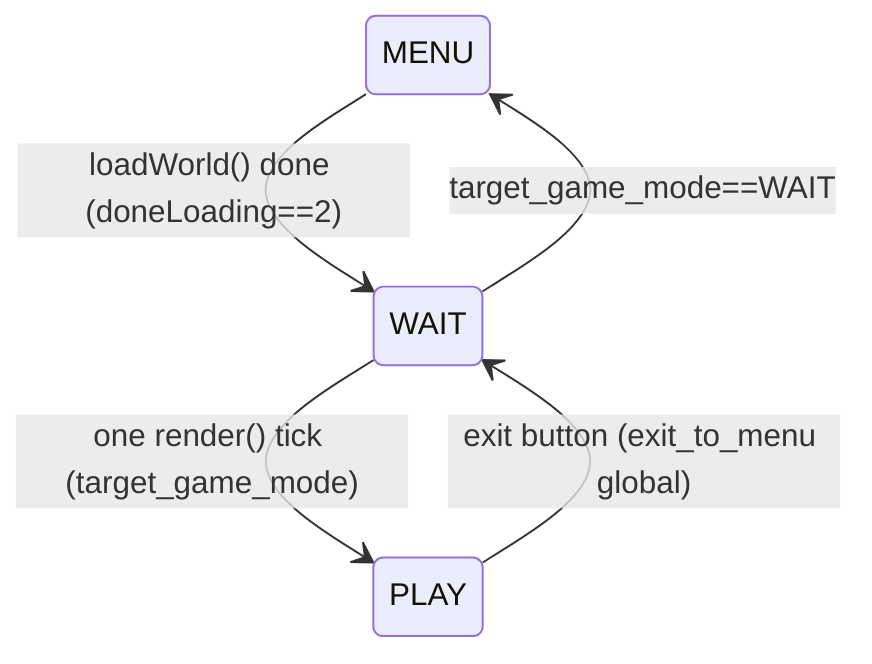

# Execution Flow, App Lifecycle & Threading

## Purpose
How the app boots, how a frame runs, the game-mode state machine, and which code runs
on which thread.

## Important files
- `main.m` — trivial `UIApplicationMain`.
- `Classes/EdenAppDelegate.mm` — sets root VC, starts Flurry + Appirater, forwards
  foreground/background to `startAnimation`/`stopAnimation`.
- `Classes/EdenViewController.mm` — owns the `EAGLContext` (ES 1.1), the CADisplayLink
  loop, device-capability detection, and the `World` instance.
- `Classes/EAGLView.mm` — CAEAGLLayer framebuffer management, screen-metric globals,
  touch forwarding to `Input`.
- `Classes/World.mm` — game-mode dispatch.

## Boot sequence

1. `MainWindow.xib` instantiates `EdenAppDelegate`, `EdenViewController`, `EAGLView`.
2. `EAGLView initWithCoder:` (runs first) sets the global screen metrics:
   `IS_IPAD`, `IS_RETINA`, `SUPPORTS_RETINA`, `IS_WIDESCREEN`, `SCREEN_WIDTH/HEIGHT`,
   `SCALE_WIDTH/HEIGHT`, `P_ASPECT_RATIO`, and probes for an ES2 context purely to
   decide the far plane: `P_ZFAR=120` if ES2-capable hardware, else `20`
   (`EAGLView.mm:82-89`). **Pitfall:** on a Retina iPhone, `IS_IPAD` is set to `TRUE` —
   the flag really means "2× logical scale", not "is an iPad".
3. `EdenViewController awakeFromNib`:
   - creates the ES1 context, sets `LOW_GRAPHICS` / `LOW_MEM_DEVICE` from
     `physicalMemory` thresholds (~480 MB / ~300 MB — `EdenViewController.mm:40-53`).
   - `world = new World()`.
4. `World::World()` (`World.mm:156`):
   - `new Resources()` (loads menu textures, audio engine),
   - `tc_initGeometry()` (fills the shared `allIndices` index buffer),
   - `new Terrain()` (which creates TerrainGenerator/Liquids/Portal/Firework —
     but **does not allocate the block arrays yet**),
   - `Graphics::initGraphics()`, `alert_init()`, `vkeyboard_init()`,
   - `new Camera/Player/Hud/FileManager/SpecialEffects/Menu`,
   - starts the menu music. Game starts in `GAME_MODE_MENU`.
   - `FileManager::FileManager()` also calls `fmh_init()` which opens the **bundled**
     `Eden.eden` default-world file and reads its directory into a hashmap
     (`FileManagerHelper.mm:25`).
5. `viewWillAppear` → `startAnimation` → CADisplayLink at 60 Hz calling `drawFrame`.

There is a compile-time alternate mode: `#define JUST_TERRAIN_GEN 1` (`World.h:35`)
turns the app into the offline default-world generator (see
[terrain-generation.md](terrain-generation.md)).

## Frame loop

`EdenViewController drawFrame` (`EdenViewController.mm:188`):

```
etime = now - last            // wall-clock delta, float seconds
setFramebuffer
world->update(etime)          // returns TRUE => retina framebuffer swap requested
world->render()
presentFramebuffer            // discards depth attachment first
[optional] delete + recreate framebuffer at other scale ("retinaSwap")
```

The retinaSwap dance exists because the menu renders at Retina resolution but the
game world runs at 1× on Retina iPhones for fill-rate reasons; entering/leaving a
world flips the CAEAGLLayer `contentsScale` and the `IS_IPAD/IS_RETINA/SCALE_*`
globals (`EdenViewController.mm:207-227`, `World::update` GAME_MODE_WAIT branch,
`World::exitToMenu` `World.mm:407-424`).

## Game-mode state machine

`World::game_mode` ∈ `GAME_MODE_MENU (0)`, `GAME_MODE_PLAY (1)`, `GAME_MODE_WAIT (2)`.



- `GAME_MODE_WAIT` is a one-frame buffer state: `World::render()` in WAIT does nothing
  but promote `target_game_mode` — this gives the framebuffer swap a clean frame.
- `exit_to_menu` is a file-static BOOL in `World.mm` set by the HUD menu; it is checked
  at the *end* of `World::render()` so teardown never happens mid-frame.
- **Modified from stock (web port, 2026-07-30):** those two transitions are the reason
  `render()` is now a one-line wrapper over `World::renderFrame(BOOL draw)`.
  `renderFrame(FALSE)` draws nothing but still runs the WAIT promotion and the
  `exit_to_menu` check, so a caller that wants to drop a frame's *drawing* (the web
  port's frame-rate cap, `web/src/entry/eden_main.cpp`) can do so without wedging a
  loading world in WAIT forever. `render()` itself is behaviourally unchanged and is
  still what every other caller uses.

### update() in PLAY mode (`World.mm:450`)
Order matters and is load-bearing:
1. `etime` clamped to max 1/20 s (physics stability).
2. `cam->update`, `terrain->update` (fire/liquids/fireworks/sky), `hud->update`.
3. `UpdateModels` (creatures) unless dead or `CREATURES_ON==false`.
4. `player->preupdate` — **this is where input is processed and blocks are edited**.
5. `effects->update`.
6. `terrain->prepareAndLoadGeometry()` — streaming + chunk re-meshing (CPU). A bulk window
   reload (the `count>140` path) is **spread over several frames** on a fixed per-frame chunk
   budget rather than done inside this one call — modified from stock, 2026-08-13; see
   [world-and-terrain.md](world-and-terrain.md) "Streaming". The save that opens a reload is
   still synchronous and still strictly before the first overwrite.
7. `terrain->updateAllImportantChunks()` — VBO uploads (GL, main thread only).

### render() in PLAY mode (`World.mm:550`)
1. `Graphics::prepareScene` (clear, perspective).
2. `cam->render` (modelview from player pos/yaw/pitch).
3. `terrain->render` — opaque terrain, doors, golden cubes, sky, portals.
4. `RenderModels` — creatures.
5. `terrain->render2` — transparent terrain (water/lava/glass/leaves...), flowers.
6. Effects, fireworks, player (third-person body is normally invisible), HUD last.

Note the world-to-GL translation: everything after the chunk passes runs inside
`glTranslatef(-chunkOffsetX*CHUNK_SIZE, 0, -chunkOffsetZ*CHUNK_SIZE)` because world
coordinates are huge (≈65,000) and must be rebased near the origin for float precision.

## World loading flow

`Menu` → `World::loadWorld(name)` (`World.mm:322`) — called **every frame** while
loading; `doneLoading` acts as the state: 0 idle → 1 loading → 2 finished.

- Normal devices: `terrain->allocateMemory()` then a **pthread**
  (`loadWorldThread`) runs `terrain->loadTerrain(name, TRUE)` while the main thread
  keeps rendering the menu + progress bar (progress = `terrain->counter/324`,
  i.e. 18×18 columns).
- `LOW_MEM_DEVICE`: fully synchronous on the main thread.
- **Pre-flight 256z refusal (web port, 2026-08-31, ROADMAP Phase M / M5.3):** before
  `allocateMemory()`, `loadWorld` reads `probeWorldHeight`; if the world is 256z **and**
  `eden_low_memory()` (web seam flag the page sets on a RAM-poor device) is set, it reports
  `eden_report_load_failure(name, "TALL_WORLD_LOW_MEM")` and resets `doneLoading`/`menu->loading`
  without touching `Terrain` — same bail shape as the corrupt-save check below, but from the main
  thread before any allocation. A from-scratch iOS build links a stub returning 0 here.
- On completion: unload menu textures, `loadGameAssets`, reset camera/player,
  `LoadModels` (creatures' POD files), switch to WAIT→PLAY.
- **The `doneLoading==2` transition does not, by itself, mean the load succeeded** —
  it only means the loader thread returned. `FileManager::loadWorld()` can bail out
  early (a corrupt/truncated save) without populating `Terrain` at all, and nothing
  in the pre-2026-07 state machine distinguished that from a real success. Fixed in
  the web port (2026-07-28, see [`web/docs/save-load.md`](../web/docs/save-load.md)):
  the transition now checks a load-failure signal (`eden_load_failed()`, web-only —
  see `web/src/seam/LoadFailure_web.h`) and, if set, resets `doneLoading`/
  `menu->loading` and stays in `GAME_MODE_MENU` instead of advancing to WAIT→PLAY.
  Advancing anyway crashes within a frame or two rendering a cleared-but-never-
  repopulated `Terrain`. A from-scratch iOS build has no such signal and would need
  its own equivalent check (or its own stub returning always-false) if this code path
  is ever reused there.

`World::exitToMenu` reverses it: `unloadTerrain`, `UnloadModels`,
`unloadGameAssets`, `terrain->deallocateMemory()`, reload menu textures, menu music.

## Threading model

| Thread | What runs there |
|---|---|
| Main (CADisplayLink) | Everything during gameplay: update, meshing, VBO upload, render, file streaming I/O |
| Load pthread (`loadWorldThread`) | Only `Terrain::loadTerrain` during the initial world load |
| NSURLConnection callbacks | Networking delegates (ShareUtil/FileDownload/FileUpload) on the main run loop |

Historically there was a chunk-building background thread and a column-streaming
thread — both are commented out in `Terrain.mm` and `World.mm`, with the author's own
race-condition annotations left in place (`//issue #1..#3` comments,
`Terrain.mm:444-573`). The `rt*` double-buffered fields on `TerrainChunk` and the
`chunksToUpdateImmediatley` list are surviving scaffolding from that design.
**Caution:** the load pthread *does* touch the same chunk table the render thread reads
(`doneLoading` handshake is the only synchronization; there are no locks). Don't add
work to the loading thread without understanding this.

## Common pitfalls
- Anything GL (VBO creation, texture loads) must stay on the main thread; the load
  thread only fills CPU-side arrays and marks chunks dirty.
- `World::update` returning `TRUE` means "swap retina framebuffer", not an error.
- `etime` is real time; long hitches are clamped to 50 ms in PLAY but *not* in menu code.
- The app has no pause/resume state beyond stopping the display link; backgrounding
  mid-game does not save — saving happens on streaming boundaries, warps, and exit.

## Safe vs. risky to modify
- **Safe:** frame-rate interval, device-capability thresholds, adding update/render
  steps at the end of the PLAY branches.
- **Caution:** reordering the update steps (streaming depends on player position being
  final; meshing depends on edits being done), the WAIT-state handshake, the retina
  swap, anything touching `doneLoading` (including its now load-failure-gated
  transition, see "World loading flow" above).
