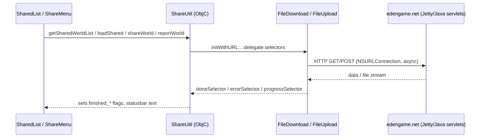

# Networking & World Sharing

## Purpose
The only networking in the game is the world-sharing service: upload a world + its
preview screenshot, browse/search/download shared worlds, report abuse. Plus
analytics (Flurry) and the long-dead TestFlight SDK.

## Architecture

## Client files
- `Classes/ShareUtil.mm` — endpoint knowledge and orchestration. Current endpoints
  (`ShareUtil.mm:48-53`; note this community fork repointed them, and the file
  preserves the historical endpoints in comments — a little archaeology of the
  service's hosting history):
  - `UPLOAD_URL  = http://app.edengame.net/upload2.php?uuid=<identifierForVendor>`
  - `LIST_URL    = http://app2.edengame.net/list2.php?start=N&sort=N` (also `?search=`)
  - `REPORT_URL  = http://app2.edengame.net/report.php?map=<file>&uuid=<...>`
  - `MAPS_URL    = http://files2.edengame.net/<file>` (worlds and `<file>.png` previews)
  - `POPULAR_URL = http://files2.edengame.net/popularlist.txt`
  - "php" names notwithstanding, the live implementation in `edenweb/` is Java.
  - `gzipInflate` exists for gzip-compressed downloads.
- `Classes/FileDownload.mm` — thin async NSURLConnection wrapper: streams to a file
  (`NSOutputStream`) or accumulates `result` NSData when `filePath` is nil;
  delegate + `doneSelector/errorSelector/progressSelector` pattern; cancellable
  (used when the user backs out of a download).
- `Classes/FileUpload.mm` — multipart/form-data POST of the world file **and** its
  `.png` preview in one request; same delegate pattern.
- `Classes/md5.c` — hashes the preview screenshot; the hash is stored in the world
  header so the server can pair/verify world↔preview.
- `Classes/FileArchive.mm` — zlib world compression for upload; **fully commented
  out** in this version (worlds upload uncompressed).

## Data formats
- The world list response is a text blob parsed by `SharedList` into
  `SharedListNode{value(downloads), name, file_name, date}` rows. (Exact separator
  format: see `SharedList::parse*` — not fully traced here; confidence medium.)
- Downloads land directly in Documents under the shared file name, then appear as
  normal local worlds (this build then runs the usual version-upgrade path on load —
  worlds from 2.2.7 load but are height-truncated, per the repo README).
- Previews download to `Documents/temp`.

## Server side (`edenweb/`, repo root — not part of the app build)
Java servlet sources: `List2.java`, `UploadMap2.java`, `Report.java`,
`Moderate.java` under `edenweb/src`, deployed on the bundled Jetty
(`edenweb/newwebserver/jetty`, also `jetty9/` at repo root). `webroot/` holds the
old website. Useful as the ground truth for request/response formats if you rebuild
the service; the community keeps a compatible service alive (this fork's modified
download path targets it).

## Identity & moderation
No accounts. The device's `identifierForVendor` UUID accompanies uploads and reports
(pre-iOS6 devices send a placeholder string). `report.php` + `Moderate.java` implement
the flag-and-review loop; `report_flag.png` in the repo root is the client asset.

## Common pitfalls
- All completion happens via selectors on the main run loop; the UI polls
  `finished_*` BOOLs each frame rather than using callbacks end-to-end — set the
  flags *and* the data before returning from a done-selector.
- `ShareUtil` reuses a single `dlmanager`; starting a new request cancels the old
  one — don't fire two concurrent downloads.
- Plain HTTP; modern iOS requires an ATS exception (this fork's Info.plist
  presumably carries one — verify if network calls silently fail).
- The upload sends both files even if the preview is missing; sharing without ever
  entering camera mode uploads a stale/absent png.

## Safe vs. risky to modify
- **Safe:** endpoint URLs, list parsing, UI feedback.
- **Caution:** the multipart body construction in `FileUpload` (server is picky),
  the delegate/selector lifetimes (manual retain/release; over-releasing the
  manager after cancel is an easy crash).
