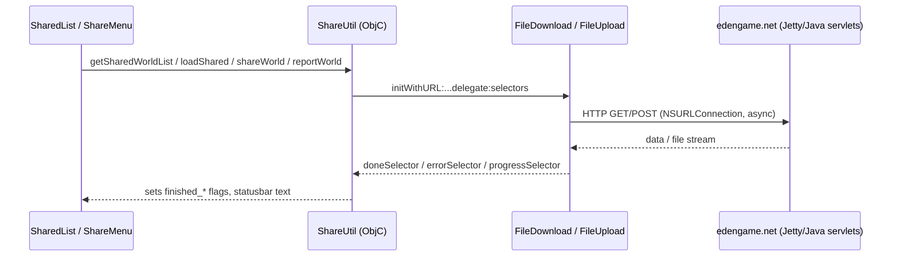

# Networking & World Sharing

## Purpose
The only networking in the game is the world-sharing service: upload a world + its
preview screenshot, browse/search/download shared worlds, report abuse. Plus
analytics (Flurry) and the long-dead TestFlight SDK.

## Architecture

```mermaid
sequenceDiagram
    participant UI as SharedList / ShareMenu
    participant SU as ShareUtil (ObjC)
    participant FD as FileDownload / FileUpload
    participant S as edengame.net (Jetty/Java servlets)
    UI->>SU: getSharedWorldList / loadShared / shareWorld / reportWorld
    SU->>FD: initWithURL:...delegate:selectors
    FD->>S: HTTP GET/POST (NSURLConnection, async)
    S-->>FD: data / file stream
    FD-->>SU: doneSelector / errorSelector / progressSelector
    SU-->>UI: sets finished_* flags, statusbar text
```

## The port's client (Stage 5.9, 2026-10-07)
None of the files below is compiled by the live port targets (they are NSURLConnection + UIKit and
seam-excluded). The port's browser is `Classes/WorldBrowser.{h,mm}` (docs/ui.md) over a tiny
non-blocking seam, `eden_net_fetch/poll/body/error/release` — implemented natively in
`native/src/seam/Net_native.cpp` (NSURLSession on Apple, libcurl on Linux, WinHTTP on Windows) and
stubbed to "no network" on web. It speaks the stock protocol to BOTH official services and adds the
community archive:

| Source | List | World | Preview |
|---|---|---|---|
| Current | `http://app2.edengame.net/list2.php?start=N&sort=2` (Recent), `?search=` (Search); `http://files2.edengame.net/popularlist.txt` (Featured) | `files2/<id>.eden` (gzip) | `files2/<id>.eden.png` |
| Legacy | the same paths on `app.` / `files.edengame.net` | `files/<id>.eden` | `files/<id>.eden.png` |
| Archive | `https://hagg3.github.io/edenarchive/assets/data/worlds.json` (JSON array) | `…/assets/worldfiles/<id>/<id>.eden.zip` (zip, sometimes zip-in-zip) | `…/<id>/<id>.eden.png` (often 404) |

**The list format, now traced (was "confidence medium" below):** plain text, `<id>.eden` and
`<name>.name` on alternating lines, no counts and no page size (Recent returned 150 per page and
Featured 100 on 2026-10-07; `popularlist.txt` repeats an id under two names). Parse by adjacency,
not by stride — a stray blank line would desync every later pair. `sort=2` is what the stock client
sends for Recent; `sort=0` returns a different ordering whose meaning is unknown. Only the `files*`
hosts answer HTTPS (CloudFront); `app*` refuse TLS, so the client stays plain HTTP and iOS needs an
ATS exception (native/ios/Info.plist.in). Neither service sends CORS headers, which is why a browser
page cannot use them. Worlds can be large: the current server's first Featured world inflated to 1.88 GB
(2026-10-07). Report is not implemented on the port. **Upload is, since S.5c (2026-10-10)** — below.

### Upload: the pinned `upload2.php` contract (S.5c)
Pinned from stock 2.1.1 (`Classes/FileUpload.mm` + `zpipe.c`'s `compressFile`) and a capture of the
2026 client (VuencEdit); the same on both hosts:
- `POST http://app2.edengame.net/upload2.php?uuid=<UUID>` (**Current**) or
  `http://app.edengame.net/upload2.php?uuid=<UUID>` (**Legacy**). Plain HTTP, as for the lists.
- `Content-Type: multipart/form-data; boundary=0xasdfasdfasdfasdfasdf`, a real `Content-Length` (no
  chunking, no `Expect: 100-continue`).
- Part `uploaded`, `filename="file.bin"`: the world **gzipped** (`deflateInit2(…, 15+16, …)`,
  `Z_DEFAULT_COMPRESSION`). Stock gzips too — `FileUpload.mm:118` calls `compressFile` before the
  POST (the "uploads uncompressed" note under `FileArchive.mm` below is about that file only).
- Part `uploaded2`, `filename="image.bin"`: the preview PNG. Neither part has a Content-Type.
- The world's header `hash` (offset 96) carries the **MD5 hex of that PNG**, so the server can pair
  them (stock `ShareUtil`). The reply is the body `YES`.
- The **Legacy server takes Legacy64z only** (very old devices): the client forces that target there.

The port's side: `Classes/WorldShare.{h,mm}` (the menu's Share > Upload: server, format picker
defaulting to the world's own format, the pre-flight loss report as the confirm), the body built a
slice per frame by `emod::begin_upload_body` (`Classes/EdenWorldExport.cpp`) into
`<world>.upload-body` beside the world — the exporter streamed through gzip between the multipart
prefix and suffix, never a raw `.eden` on disk — then `eden_net_post_file(url, contentType,
bodyPath)` (`WorldBrowser.h`; native `Net_native.cpp` over the backend's `post_file`: NSURLSession
upload-from-file, libcurl `READFUNCTION` + `POSTFIELDSIZE_LARGE`, WinHTTP `WinHttpWriteData`), and
the temp is deleted. An upload needs `<world file>.png` (camera mode); without it the action says
so. Fixture mode (`--net-fixtures`) answers a POST from `<root>/<host>/<path>` and saves the body
beside it as `<path>.posted`, which is how `--browser-selftest` and `TESTERS/s5/upload_gate.py`
check the bytes offline. **No live upload has been made by a harness**: one per host is the user's
to do. Web has none (no CORS on either host).

**Get Worlds converts (S.5).** With the `.emod` switch on, a finished download is not unpacked to a
`.eden`: `WorldBrowser`'s `DL_CONVERT` runs `emod::ImportJob` on it (layers unpacked still
compressed, the innermost stream converted), lands `<id>.emod`, and deletes the download.

## Client files
- `Classes/ShareUtil.mm` — endpoint knowledge and orchestration. Current endpoints
  (`ShareUtil.mm:48-53`; note this community fork repointed them, and the file
  preserves the historical endpoints in comments — a little archaeology of the
  service's hosting history):
  - `UPLOAD_URL  = http://app.edengame.net/upload2.php?uuid=<identifierForVendor>`
  - `LIST_URL    = http://app2.edengame.net/list2.php?start=N&sort=N` (also `?search=`)
  - `REPORT_URL  = http://app2.edengame.net/report.php?map=<file>&uuid=<...>`
  - `MAPS_URL    = http://files2.edengame.net/<file>` (worlds and `<file>.png` previews)
  - `POPULAR_URL = http://files2.edengame.net/popularlist.txt`
  - "php" names notwithstanding, the live implementation in `edenweb/` is Java.
  - `gzipInflate` exists for gzip-compressed downloads.
- `Classes/FileDownload.mm` — thin async NSURLConnection wrapper: streams to a file
  (`NSOutputStream`) or accumulates `result` NSData when `filePath` is nil;
  delegate + `doneSelector/errorSelector/progressSelector` pattern; cancellable
  (used when the user backs out of a download).
- `Classes/FileUpload.mm` — multipart/form-data POST of the world file **and** its
  `.png` preview in one request; same delegate pattern.
- `Classes/md5.c` — hashes the preview screenshot; the hash is stored in the world
  header so the server can pair/verify world↔preview.
- `Classes/FileArchive.mm` — zlib world compression; **fully commented out** in this
  version. Uploads are still gzipped: `FileUpload.mm` calls `compressFile` itself (S.5c).

## Data formats
- The world list response is a text blob parsed by `SharedList` into
  `SharedListNode{value(downloads), name, file_name, date}` rows. (Exact separator
  format: see `SharedList::parse*` — not fully traced here; confidence medium.)
- Downloads land directly in Documents under the shared file name, then appear as
  normal local worlds (this build then runs the usual version-upgrade path on load —
  worlds from 2.2.7 load but are height-truncated, per the repo README).
- **Port (native Get Worlds, `Classes/WorldBrowser.mm`):** the gzip/zip is unpacked into a
  full `<id>.eden` in Documents. There is **no free-space check**, so a big 256z world (GBs
  inflated) fails mid-write on a small device. Planned fix, Stage S (S.3 converter, S.5
  wiring): convert to `.emod` while inflating, delete the download afterwards, peak temp
  ~3× the download. See `WORKING/emod-format-implementation-plan-2026-10-03.md` §4
  *Downloads and imports*.
- Previews download to `Documents/temp`.

## Server side (`edenweb/`, repo root — not part of the app build)
Java servlet sources: `List2.java`, `UploadMap2.java`, `Report.java`,
`Moderate.java` under `edenweb/src`, deployed on the bundled Jetty
(`edenweb/newwebserver/jetty`, also `jetty9/` at repo root). `webroot/` holds the
old website. Useful as the ground truth for request/response formats if you rebuild
the service; the community keeps a compatible service alive (this fork's modified
download path targets it).

## Identity & moderation
No accounts. The device's `identifierForVendor` UUID accompanies uploads and reports
(pre-iOS6 devices send a placeholder string). `report.php` + `Moderate.java` implement
the flag-and-review loop; `report_flag.png` in the repo root is the client asset.

## Common pitfalls
- All completion happens via selectors on the main run loop; the UI polls
  `finished_*` BOOLs each frame rather than using callbacks end-to-end — set the
  flags *and* the data before returning from a done-selector.
- `ShareUtil` reuses a single `dlmanager`; starting a new request cancels the old
  one — don't fire two concurrent downloads.
- Plain HTTP; modern iOS requires an ATS exception (this fork's Info.plist
  presumably carries one — verify if network calls silently fail).
- The upload sends both files even if the preview is missing; sharing without ever
  entering camera mode uploads a stale/absent png.

## Safe vs. risky to modify
- **Safe:** endpoint URLs, list parsing, UI feedback.
- **Caution:** the multipart body construction in `FileUpload` (server is picky),
  the delegate/selector lifetimes (manual retain/release; over-releasing the
  manager after cancel is an easy crash).
