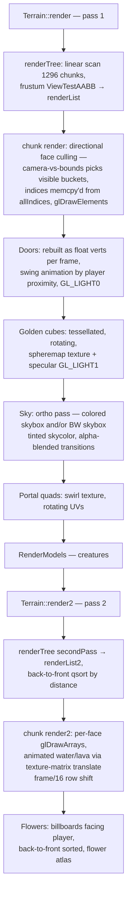

# Rendering Pipeline

## Purpose
Everything drawn on screen: GL state management, chunk meshing, the two terrain
passes, special objects, sky, and the per-vertex data formats.

## Fixed constraints
- **OpenGL ES 1.1, fixed-function.** No shaders anywhere. Lighting effects are baked
  into vertex colors; the only uses of GL lighting are doors and the golden cube's
  env-mapped specular highlight.
- Single 16-bit depth buffer, RGBA8 color, depth attachment discarded before present
  (`EAGLView.mm:303`).

## Important files
- `Classes/Graphics.mm/.h` — static GL state helpers + the vertex struct definitions.
- `Classes/TerrainChunk.mm` — mesh generation (`rebuild2`), VBO upload (`prepareVBO`),
  chunk draw (`render`, `render2`).
- `Classes/Terrain.mm` — frame-level terrain passes, object batches, sky.
- `Classes/Geometry.mm` — the canonical cube/ramp/side/liquid vertex+UV tables and the
  shared `allIndices[32768]` identity index array.
- `Classes/Frustum.mm` — plane extraction + AABB test (`ViewTestAABB`).
- `Classes/Camera.mm` — view matrix from player state.
- `Classes/glu.h`, `project.c` — GLU port used for `gluPerspective`/`gluUnProject`.

## Vertex formats (`Graphics.h:51-84`)
- `vertexStructSmall` — terrain: `GLshort position[3]` + pad, `GLubyte colors[4]`,
  `GLshort texs[2]`. Positions are **premultiplied by 4** (quarter-block units) and
  chunk-local; the chunk's `render()` translates by `(pbounds - chunkOffset*16)*4`
  and `Terrain::render2` wraps everything in `glScalef(.25,.25,.25)`; pass 1 relies on
  the modelview already being scaled the same way via `Graphics::beginTerrain`.
  UV shorts are normalized by a **texture matrix** trick: `glMatrixMode(GL_TEXTURE);
  glScalef(1, 1/32, 1)` around the terrain passes (atlas is a 1×32-tile strip).
- `vertexObject` — float version used for per-frame immediate batches (doors, cubes,
  portals, flowers, creatures env-map).
- `vertexpStruct` / `vertexpBreak` — point-sprite particles / block-break debris.

## Graphics state helpers (`Graphics.mm`)
`prepareScene` (clear + `gluPerspective(eden_fov_degrees, aspect, 0.012, ZFAR-25)` — the fovy
was a hard-coded `80` until Phase N Stage 2.5; it now reads the shared FOV setting
(`web/src/seam/Settings_web.mm`, `> 0` guard falls back to 80). Web additionally intercepts the
call with `--wrap` and feeds the same value, so both targets agree.),
`beginTerrain/endTerrain` (fog on, color arrays, atlas bind, ×0.25 scale),
`beginHud/endHud` and `prepareMenu/endMenu` (ortho 2D), `setZFAR` (also re-derives the
linear fog band: start `ZFAR-ZFAR/1.6`, end `ZFAR-30`). Fog color tracks sky color
(`Terrain::update`). ZFAR: 120 on ES2-class devices, 40–55 on 1st-gen hardware
(`FileManager.mm:1606-1617`).

## Chunk meshing — `TerrainChunk::rebuild2()` (`TerrainChunk.mm:184`, "here be dragons")

CPU-side, runs on the main thread inside `prepareAndLoadGeometry`. Stages:

1. **Scan pass** over `pblocks`: find lightboxes (`has_light`), clamp corrupt types to
   stone, note whether the chunk contains any `IS_ATLAS2` (transparent) blocks,
   count `StaticObject`s (doors/golden cubes/flowers/portal tops), and fill the
   `hasBlocky[y]` row-skip table.
2. **Face visibility**: for each block, 6-bit mask of faces exposed to a
   `IS_NOTSOLID` neighbour (fast path when no transparent blocks; a slower variant
   handles liquid-level and same-type-same-color suppression so adjacent water
   surfaces don't z-fight). Bottom faces at y=0 are culled; top faces at the world
   ceiling are forced visible.
3. **Counting pass**: vertices are bucketed **per face direction** into 7 buckets
   (6 axis directions + bucket 6 for the "angled" face of ramps/sides, which can't be
   directionally culled). Two independent mesh streams: stream 1 (opaque, atlas 1)
   and stream 2 (`IS_ATLAS2`: water, lava, glass, leaves, weave, trampoline pads…).
   Objects are extracted into `objects[]` instead of meshed (portal *frames* also
   emit regular cube geometry).
4. **Fill pass**: writes `vertexStructSmall`s. Per-vertex color =
   `light[rgb] × paint[rgb] × cubeColors[face]` where `cubeColors` is the fixed
   per-face shade (fake directional light), `light` comes from `calcLight`
   (skylight 0.35 at night + colored `lightarray` contribution), plus special cases:
   burned blocks half-brightness, lava/lightbox fullbright, ramps/side pieces get
   precomputed `gshadows` face shades, water alpha 145. Unpainted (`color==0`)
   colorable blocks (grass, TNT, brick, vine…) swap to the non-color atlas tile and
   use `blockColor` tint instead. Liquid blocks rewrite the cube's y-coordinates from
   the per-level `liquidCube` table so surfaces slope toward the outflow direction
   (chooses one of the 4 `side*Texture` top orientations).
   Face-merging (greedy strips via `face_size`) exists but is **disabled** — the code
   is under "UNCOMMENT FOR FACE MERGING" comments; `size` is always 1.
5. Rebuild `face_idx[]` prefix sums; set `needsVBO`.

Empty-result chunks set `clearOldVerticesOnly` so `prepareVBO` frees GL buffers.

### Re-entrancy (modified from stock, 2026-08-27)
`rebuild2()` is now safe to run on a thread other than the one that owns the world, because the
mesher is being moved onto a worker (`WORKING/b3-off-thread-meshing-plan.md`). Nothing about *what*
it meshes changed. Three things did:

- Its scratch (`v_idx`, `v_idx2`, `face_visibility[]`, `face_size[]`, `hasBlocky[]`, `hasVisy[]`)
  was file-scope `static`, i.e. one copy shared by every call. It is now tagged `EDEN_MESH_TLS`,
  which is `thread_local` when the build defines `EDEN_THREADED` and **empty otherwise** — the
  single-threaded and iOS builds are unchanged.
- The counting pass and the fill pass both read the chunk's own `pblocks`/`pcolors`, and
  `Terrain::setLand` writes those directly on every block edit. A write landing between the two
  passes changes a block's face count and overruns the vertex buffer, so a worker meshes from a
  private 8 KB snapshot instead: `tc_meshSetSource()` installs it and `rebuild2()` resolves it once
  per call into `mblocks`/`mcolors`. Its *other* global reads (neighbour `blockarray`, `lightarray`,
  `getColorc`) all feed `face_visibility[]`, which is private scratch computed **before** both
  passes — so staleness there is cosmetic and cannot break the invariant.
- The three things it did to global state are now deferrable: `Portal::addPortal` (portal tops) and
  the corrupt-type `setLand` repair queue into a caller-supplied `MeshSideEffect` sink that the main
  thread replays via `tc_meshReplaySideEffects()`, and `isOnFire()`'s walk of the main thread's
  mutable `burnList` is replaced by a precomputed per-chunk burn mask. With no sink and no mask
  installed — the single-threaded default — all three behave exactly as stock.

### Off-thread meshing (modified from stock, 2026-08-27)
The re-entrancy above exists because bulk-reload chunks are now meshed on **worker threads**
(`Classes/MeshPool.{h,mm}`; design in `WORKING/b3-off-thread-meshing-plan.md`). The split follows
the `rt*` boundary that `prepareVBO()` already was:

> a worker fills the chunk's **non-`rt`** fields via `rebuild2()`; the main thread calls
> `prepareVBO()` to publish them into `rt*` and upload. **GL never leaves the main thread**, so
> convention #4 holds unchanged — and it costs nothing, because upload is under 1% of a burst.

- **Scope, deliberately narrow.** Only chunks dirtied by a **bulk window reload** (`Terrain.mm`'s
  `bulk_reload_active`) go to a worker. Player edits, explosions, fire and the initial world load
  still mesh inline, in the same frame, exactly as before — they are few, latency-sensitive and next
  to the player.
- **Dispatch** is in `Terrain::prepareAndLoadGeometry` where `rebuild2()` used to be called;
  **publish** is `mp_publishFinished()`, called both at the top of that function and in
  `updateAllImportantChunks`. Each chunk carries an atomic `meshJobState`
  (`IDLE→QUEUED→RUNNING→DONE→IDLE`); the worker's `DONE` is a release store and the main thread's
  read an acquire, which is what orders the vertex buffer against the counts describing it.
- **A worker never touches live world state.** It meshes an 8 KB snapshot of the chunk's own
  `pblocks`/`pcolors`, is handed a precomputed burn mask instead of walking `burnList`, and queues
  its two global mutations into a `MeshSideEffect` sink the main thread replays at publish time.
- **Three invalidation rules carry the correctness** and are the things to preserve when touching
  any of this:
  1. *A chunk with a job in flight is never recycled.* `readColumn()` re-homes a whole column
     (`setBounds()` plus a wholesale voxel rewrite), so the reload skips a column whose chunks are
     not all `IDLE` and takes the next-nearest stale one instead; the dirty-list build skips busy
     chunks the same way, leaving their flags set. `Terrain::deallocateMemory` and `loadTerrain`
     drain the pool.
  2. *An edit during a job makes the mesh stale, not torn* — the worker read a snapshot. The mesh is
     **published anyway** and the chunk re-dirtied. Discarding it would leave the chunk with no
     geometry at all, which draws as a hole.
  3. *Fire meshes inline.* `burnList` is a list the main thread frees nodes from.
- **Two kill switches, both intentional.** Without `EDEN_THREADED` every `mp_*` entry point compiles
  to a no-op and `mp_dispatch()` always answers "mesh it yourself" — the stock path, byte for byte.
  And "no free job slot → mesh inline" means a pool size of 0 disables the feature without removing
  it.
- The same pool also **decodes streamed columns** off-thread. `fmh_readColumnFromDefault` is split
  into a main-thread raw read, a **pure** `fmh_decodeColumnBands()` (RLE run-expansion + the
  `CC(x,z,y)`↔`CC(y,z,x)` band transpose) that a worker runs, and a main-thread publish that
  re-homes the chunks and writes `blockarray`. A decode job owns a whole **column**, so all its
  chunks are marked busy together. `FileManager::readColumnDeferred()` is the reload's entry point;
  answering FALSE means "dispatched, not landed", and the column must not be marked resident yet.
  `readColumn()` itself is unchanged and still synchronous for every other caller.
- Measured effect on a teleport burst: frames over the 16.66 ms budget 4–7 per 5 bursts → 0,
  frames over 8.3 ms 60–66 → 19–24, main-thread column read 129–147 → 110–119 ms, with the window
  still filling in the same wall clock and the resulting geometry byte-identical to the inline
  mesher's. The mesher (not the decoder) is what produced the frame-level change.

### VBO upload — `prepareVBO()` (`TerrainChunk.mm:1433`)
Copies the plain fields into the `rt*` (render) fields, mallocs the per-chunk index
scratch `rtindices`, uploads the two vertex streams and (re)creates `elementBuffer`,
then frees the staging arrays. The plain/`rt` split is leftover double-buffering from the
removed background meshing thread — today both halves are always in sync.

**Since ROADMAP Phase M / M3(a) (2026-08-31) the GL buffer names persist across re-meshes.**
`prepareVBO` used to `glDeleteBuffers` + `glGenBuffers` all three names every rebuild, so a
full-window reload burst did ~1,500 buffer create/delete calls in a couple of seconds. Now
`chunkUploadArray()` keeps each name, tracks its byte capacity (`vbCapacity`/`vb2Capacity`,
never shrinks) and re-uploads with `glBufferSubData` when the new geometry fits, `glBufferData`
only to grow — the same pattern row E3 gave the object batches. The names are still deleted for
real in `unbuild()`, the destructor, and the `clearOldVerticesOnly` clear path. `render()`
early-returns on `rtn_vertices==0` and `render2()` only runs for chunks with `rtn_vertices2>0`,
so a name left allocated with stale contents is never drawn. Done for driver/CPU churn, not
memory — the buffers live in the browser's GPU process (see `WORKING/web-port-memory-plan.md`
§M3).

**Since Phase N Stage 1 (2026-09-05) `prepareVBO()` can also fingerprint what it publishes.**
`rtGeomHash`/`rtFullHash` (`TerrainChunk.h`) are FNV-1a hashes of the vertex arrays, folded *just
before* the staging arrays are freed and read back by `eden_debug_mesh_checksum()`. They live on
the chunk rather than in the probe for a structural reason worth knowing: after `prepareVBO()` the
only copy of the vertex data is inside a GL buffer, so a probe that walks `chunkTablec` in a
settled world finds `verticesbg == NULL` and reports zero vertices. Publish time is the only moment
the data exists. `geom` covers position+texcoord (deterministic across platforms), `full` adds the
baked vertex colours (lighting, so it only converges after equal settling); `pad` is excluded
because the mesher never assigns it. The whole pass is **off by default** —
`eden_debug_set_mesh_checksum(1)` enables it, and it must be called before the world is meshed.
This is what proved the native (SDL3 + desktop GL) build meshes byte-identically to the web build
at both heights: `WORKING/phase-n-stage1-results-2026-09-05.md`.

**`render()`'s only "is there geometry" test is `rtn_vertices==0`, so every `rt*` field has to
say "empty" from construction, not from the first `prepareVBO()`.** The constructor did not
initialise them until 2026-08-27: a chunk is allocated out of a heap that has just held vertex and
colour data, so `rtn_vertices` came up garbage-nonzero, `render()` sailed past the guard, and the
index re-pack `memcpy`'d from `allIndices + rtface_idx[i]` with `rtface_idx[i]` in the tens of
millions (into a NULL `rtindices`) — an out-of-bounds trap inside the frame tick. Stock never
reached it because a chunk was always meshed before it could be drawn. **Anything that lets a
resident chunk be drawn before its first mesh — the bulk reload's neighbourhood deferral
([world-and-terrain.md](world-and-terrain.md)), or a worker-thread mesher whose output lands a
frame late — depends on that initialisation.** Note the re-pack still bounds only its
*destination* cursor against `INDICES_MAX`, not `rtface_idx[i]+rtnum_vertices[i]`; that is fine
while a chunk cannot exceed 32768 vertices, and is the guard to revisit if one ever can.

## Frame passes

Pass-1 directional culling detail (`TerrainChunk::render`): for each of the 6 buckets,
`curVis[f]` compares camera position against chunk bounds (you can't see the +X faces
if you're at lower X than the chunk, etc.). When visibility changes, the chunk's index
buffer is re-packed by memcpy-ing runs of the identity `allIndices` array — cheap
because vertices are already grouped by face. Pass 1 already submits all 6 visible
buckets in **one** `glDrawElements` call against the re-packed index buffer, so it never
had the row-#20 problem below — only pass 2's `glDrawArrays` path did.

**Pass-2 chunk draw batching (perf-audit row #20, `TerrainChunk::render2`).** The 6 face
buckets in `vertexBuffer2` are laid out back-to-back by construction
(`face_idx2[i]=num_vertices2[i-1]+face_idx2[i-1]`, `TerrainChunk.mm` around the mesher's
counting pass), but `render2()` used to issue one `glDrawArrays` per visible bucket, in a
scrambled per-axis order (5,1,0,3,2,4, not ascending index order) — 6 draw calls, an ES1
artefact once WebGL made per-call overhead real (§2/C2 of the perf audit). Since 2026-07-30
it collapses to **one** `glDrawArrays` over the whole contiguous span when all 6 buckets are
visible (the common case: it just means the camera sits within the chunk's XYZ bounds), and
falls back to the original 6 separate per-face draws, in their original order, otherwise
(the rarer partial-visibility case, typically a chunk at the world's edge). The merged path
does submit the 6 buckets in ascending-index order rather than the scrambled one, which is a
real order change — accepted because it only affects which of two *translucent triangles
from different faces of the same chunk* wins a rasterizer tie at the same screen pixel and
depth, which this stream (water/lava/glass/leaves quads facing 6 different directions of one
16×16×64 chunk) essentially never triggers. The cross-chunk order that actually matters for
translucency — `Terrain::render2`'s `renderList2` back-to-front qsort by chunk distance,
diagrammed above — is untouched; this is purely an intra-chunk optimization.

Water/lava animation: atlas 2 rows are animation frames; `render2` advances a global
`frame` counter and translates the texture matrix by `(int)(frame/16)` rows.

The sky is not a skybox mesh — it's screen-space ortho quads (`Texture2D::drawSky`)
drawn *between* pass 1 and pass 2 at near-far depth, with a colored/B&W crossfade
state machine for sky-color regions (`Terrain.mm:3073-3170`).

## Camera (`Camera.mm`)
First-person: position = player pos (eye offset), yaw/pitch from touch-look. `render()`
builds the modelview (rotate, then translate by `-(pos - chunkOffset*16)`); `render2()`
is the same matrix used by the picking raycast. `mode`/`THIRD_PERSON` exists but is
compile-time disabled.

## Frustum culling (`Frustum.mm`)
`setFrustum(viewproj)` extracts 6 planes each frame (called from `Camera::render`);
`ViewTestAABB(rbounds, state)` does plane/AABB rejection with an inside-plane bitmask
optimization. Chunks failing entirely are skipped; there is no hierarchy (octree
removed).

## Object batch upload (perf-audit row 23/E3, 2026-08-06)
Doors, golden cubes, portal frames, portal swirls and flowers are still rebuilt on the
CPU every frame (animation — door swing, cube rotation, portal UV swirl, flower
billboard yaw — is unavoidable), but each batch now owns a persistent
`GL_DYNAMIC_DRAW` buffer (`Terrain.mm`: `ObjectBatch`/`objBatchStage`/`objBatchDraw`,
`g_doorBatch`/`g_goldenBatch`/`g_portalBatch`/`g_swirlBatch`/`g_flowerBatch`) instead of
filling a stack-local `vertexObject objVertices[]` and handing GL four client-side
array pointers. The frame still fills a staging array exactly as before; the change is
one `glBufferSubData` upload per batch (growing via `glBufferData` in power-of-two
steps) instead of the GL shim silently re-uploading all four client arrays' worth of
the same bytes per draw (`gl_es1_shim.cpp`, `eden_gl_setup_attributes` — client-side
vertex data isn't legal in WebGL). One buffer per batch, not a shared one — a shared
buffer would make its `glBufferSubData` a write the previous batch's draw is still
reading (driver sync stall each batch); five small elidable rebinds cost less than
that. Measured live in Safari (`web/tools/safari-objbatch-probe.js`, 24 doors + 24
golden cubes + 24 portals + 144 flowers): upload traffic dropped from 47
`glBufferData`/frame, 756.5 KB/frame (44.3 MB/s @ 60fps) to 8 `glBufferData` + 5
`glBufferSubData`/frame, 176.6 KB/frame (10.3 MB/s) — a 4.3× drop.

This also retired three latent stack-overrun bugs the old fixed `max_render_objects*6*6`
(10800-vertex) array had: golden cubes emit 144 vertices each (76 visible cubes
overran it), flowers emit 6 each against `MAX_FLOWERS=10000` (1801 visible overran
it), and `doorso`/`portalso` were unbounded writes into 500/200-entry stack arrays
(now clamped). The new staging arrays `realloc` to fit and return `NULL` on failure
rather than lying — every call site guards its loop with `objVertices&&`.

Instancing for the non-animated subset (portal frames, which reuse regular cube
geometry) is a separate future item (row 24/C2, WebGL2) — not done here.

## Performance characteristics & knobs
- Meshing a chunk is O(4096·faces); a full window re-mesh (~1296 chunks) happens on
  load and on lighting changes — this is the main hitch source.
- `INDICES_MAX = 32768` (`Geometry.h`) caps vertices per chunk stream; faces beyond it
  are silently dropped (`render` guards with `continue`).
- `max_render_objects = 300` caps doors/cubes/portals per frame; `MAX_FLOWERS 10000`.
- Disabled experiments you may see: occlusion queries (`isTesting`), distance-based
  ZFAR throttling by FPS, face merging.

## Common pitfalls
- Terrain vertex positions are shorts in quarter-block units — forgetting the ×4/×0.25
  produces subtly misplaced geometry.
- Object batches used to allocate `vertexObject objVertices[300*36]` on the stack;
  since row 23/E3 (2026-08-06) they're heap-backed persistent VBOs (`ObjectBatch`,
  above) that `realloc` to fit, so this is no longer a stack-overflow risk.
- GL state leaks easily: every pass assumes the previous one restored texture-matrix
  scale, fog, blend, and client arrays. Match every `glScalef` on `GL_TEXTURE` with
  its inverse (the code does this manually, e.g. `Terrain.mm:3299`).
- `glDrawElements` with a stale `elementBuffer` after buffer deletion order changes
  crashes on device but often works in simulator.

## Safe vs. risky to modify
- **Safe:** colors/shade tables, fog parameters, adding a new object batch modeled on
  the flower/portal loops, atlas layout changes (update `getBlockTexShort` +
  `blockTypeFaces`).
- **Caution:** `rebuild2` (counting and fill passes must stay exactly consistent or
  you'll write past `verticesbg`), bucket/`face_idx` bookkeeping, `prepareVBO`
  swap ordering, anything shared with the old threading design.
