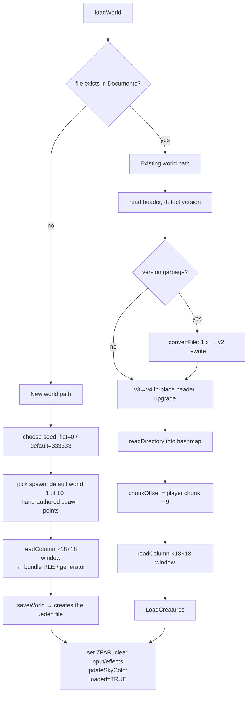

# Save / Load Pipeline

## Purpose
How world files are opened, streamed, saved and migrated at runtime. The on-disk
format itself is specified in [eden-file-format.md](eden-file-format.md).

## Important files & types
- `Classes/FileManager.mm/.h` — everything: `loadWorld`, `saveWorld`, `readColumn`,
  `saveColumn`, directory management, legacy conversion, plus the offline
  `saveGenColumn`/`writeGenToDisk` used by the world generator.
- `Classes/FileManagerHelper.mm` — read-only access to the **bundled** default world
  `Eden.eden` (its own file handle, header and directory hashmap; the comment at the
  top warns the identically-named statics refer to the *default* world, not the
  active one). Since Phase N Stage 4.4, `fmh_init()` prefers a bundled `Eden.eden.gz`
  over the raw file when present (iOS only — `native/CMakeLists.txt` gzips it at
  build time because the iOS bundle is copied into the `.app`, not symlinked like
  every other native target): it inflates the bundle asset once, with
  `Classes/zpipe.c`'s `decompressFile()`, into `<documents>/Eden.eden.cache` and
  reopens that cache file on every later launch, since the bundle itself is
  read-only and can't be decompressed in place.
- `Classes/hashmap.mm` — int-keyed hashmap holding `ColumnIndex*` records.
- File-scope statics in `FileManager.mm`: `saveFile` (NSFileHandle), `sfh` (in-memory
  header), `indexes` (directory hashmap), `cur_dir_offset`, `file_version`,
  `imgHash`. **The FileManager is effectively a singleton with global mutable state**
  — two worlds can never be open at once.

## Load flow — `FileManager::loadWorld(name, fromArchive)` (`FileManager.mm:1346`)

Notes:
- New-world types: the `g_terrain_type` switch is hardwired to 9 (`gen_default`);
  types 0–8 (dirt/rivers/mountains/desert/ponies/beach/mix/flat) are the offline
  generator's biome recipes and are only reachable by editing the code. The menu's
  "flat world" option sets `genflat` → seed 0.
- The 10 default spawn points (`spx/spz/spy/spyaw` arrays, `FileManager.mm:1425`) are
  hand-picked scenic locations; consecutive new worlds avoid repeating the last one.
- `player->pos`/`yaw`, `home`, seed, golden cubes, region sky colors all come from the
  header. `chunkOffsetX/Z` (the render-origin/streaming anchor owned by FileManager)
  is derived from the player position.

## Column streaming — `readColumn(cx, cz, fileHandle)` (`FileManager.mm:802`)

Resolution order for a requested column:
1. **Directory hit** → seek `chunk_offset`, read 4 chunks of raw type+color bytes
   into the (reused) `TerrainChunk` objects, memcpy type strips into `blockarray`,
   `ter->addChunk(...)` marks the chunk + neighbours dirty for meshing.
2. **Directory miss, seed == 333333** → `fmh_readColumnFromDefault`: same procedure
   against the bundled `Eden.eden`, RLE-decoding and transposing each chunk. If even
   the bundle lacks the column (outside the generated 2880×2880 area) →
   `generateEmptyColumn` (air).
3. **Directory miss, other seed** → `TerrainGenerator::generateColumn` (flat-world
   layers; see [terrain-generation.md](terrain-generation.md)).

Called from two places: initial load (18×18 loop in `loadWorld`) and the per-frame
streaming check in `Terrain::prepareAndLoadGeometry` (which opens a fresh read-only
NSFileHandle each streaming event).

## Save flow — `FileManager::saveWorld(warpPos)` (`FileManager.mm:366`)

1. `terrain->endDynamics(TRUE)` — extinguish fires, clear liquids/effects (dynamics
   are **not** persisted; a burning world saves as not-burning).
2. Rebuild header from live state (seed, home, pos←warp, yaw, golden cubes, sky
   colors, display name from the menu's selected world, image hash).
3. If the file doesn't exist: create it with a fresh header (v2 bootstrap).
4. `readDirectory()` — re-read the on-disk directory into the hashmap (source of
   truth for existing column offsets).
5. For each of the 18×18 resident columns: `saveColumn(cx,cz)`:
   - skip unless any chunk in the column has `modified` set (flags are cleared here);
   - existing directory entry → overwrite in place at its `chunk_offset`;
   - new entry → `chunk_offset = directory_offset − sizeof(EntityData)·MAX_CREATURES_SAVED`
     (i.e. where the creature block currently starts), `directory_offset += SIZEOF_COLUMN`,
     `writeDirectory=TRUE`;
   - write `CHUNKS_PER_COLUMN`×(pblocks, pcolors) raw.
6. `saveCreatures()` — `SaveModels()` fills `creatureData[]`, written at
   `directory_offset − sizeof(EntityData)·MAX_CREATURES_SAVED`. (v<3 files get the block
   appended and become v3+.)
7. Stamp `version=4` — **unless the file arrived as version ≥ 5**, in which case it keeps its
   own version. If any column was appended, `fwriteDirectory()` rewrites the whole directory at
   `directory_offset` (plus the sign trailer, below), then the header is rewritten at offset 0 —
   **header last**, because it is the only thing that says where the directory is, and on the
   in-place path below it is the nearest thing this format has to a commit record.

### Two save strategies, chosen by file size (2026-08-25)
Steps 3–7 above run against a **scratch copy** of the world (`<file>.savetmp`), which one
`rename()` swaps in at the very end — so any crash before that rename leaves the previous save
byte-identical. That is still what happens for a file **below `g_save_inplace_threshold`**
(`Constants.h`, 16 MiB by default), which is every ordinary world.

At or above the threshold the copy is the problem, not the protection: it is O(file size) in time
*and* in peak memory, and a 256z world can be gigabytes. Measured on a real 279 MB 256z specimen
with **nothing edited** (`web/tools/headless-save-io-probe.js`): 558 MB read + 558 MB written per
save, against ~155 KB of genuinely-changed bytes. So above the threshold `saveWorld` writes
straight into the world file and protects it with a **rollback journal** instead:

The journal has **two phases**, written in that order and both before the first destructive byte:

- **Phase 1 — the structural tail.** `beginSaveJournal()` writes `<file>.savejrnl`: a small header
  (magic `EDNJRNL`, version 2, original length, region offset/length) plus the world's current
  192-byte header and the file's tail from `directory_offset − creature block` to EOF. That tail
  is exactly the region an *append* destroys: a new column record starts at
  `directory_offset − creature block` and overwrites the old creature block and the front of the
  old directory. O(number of columns), not O(file size) — about 410 KB for a 3.97 GB world.
- **Phase 2 — the dirty columns** (2026-09-02, ROADMAP C3). `journalDirtyColumns()` appends one
  `EDNJCOL` record per column this save is about to overwrite *at its own existing offset*,
  holding that column's original bytes. It runs after `readDirectory()`, because "does this column
  already have a directory row" is what separates an overwrite (needs a pre-image) from an append
  (phase 1 already covers it) — and `readDirectory()` only reads, so this is still ahead of every
  destructive write. It must not clear `modified`; `saveColumn()` owns that flag, and if the
  journal fails the save is skipped and the flags have to survive for the next attempt.
- Removing the journal after `closeFile` is the commit. `recoverInterruptedSave()` (called from
  `probeWorldHeight`, i.e. before anything reads the header, and again from `loadWorld`) replays a
  surviving journal: restore the region, truncate to the original length, restore the header, then
  write back each `EDNJCOL` pre-image. It is idempotent; a journal too short to be complete is
  discarded because it proves the crash happened *before* the world file was touched, and the
  record scan stops at the first torn record for the same reason (a half-written pre-image proves
  its column had not been reached yet). Records are disjoint by construction — one per column per
  save — so replay order does not matter.
- **What it costs, measured.** Phase 2 is one extra read + write of exactly the columns the save
  was already writing. On the real 279 MB 256z specimen: a steady-state autosave with nothing
  edited is **unchanged** (127 KB read / 83 KB written — zero dirty columns means zero records),
  and a save with one edited column goes **155 KB → 259 KB read and 214 KB → 345 KB written**
  (+131,096 B = one 131,072 B column plus a 24-byte record header). The in-place path stays
  O(dirty columns) and never returns to O(file size). `g_save_journal_columns`
  (`Classes/Constants.h`, default on) turns phase 2 off, reproducing the pre-C3 behaviour; it
  exists so the cost can be A/B'd and as a one-flag rollback.
- **What it replaced.** Through 2026-09-01 the journal was phase 1 only, and this list ended with
  an honest caveat: a crash between journal and commit could leave an individual dirty column
  half-old/half-new — the file still loaded and the directory was still valid, but a chunk of
  terrain was garbage and nothing could detect or repair it. The estimate that made that trade
  look right ("up to ~42 MB per save at 256z") was the worst case — every column in the resident
  window dirty at once — and the typical case is the two numbers above. The in-place save path is
  fully atomic again.
- Above the threshold the port also stops maintaining a **whole-file backup slot**
  (`<file>.savetmp.bak` / `<file>.bak`, `web/src/shim/foundation/NSFileHandle.mm`) and deletes any
  stale one it finds: nothing above the threshold would ever refresh it, so it is a permanent
  second copy of the world that the load-failure dialog would offer as if it were the previous
  save. Durability above the threshold is the journal.
- If **either phase** of the journal cannot be written (or, below the threshold, if the scratch
  copy fails), the save is **skipped** with a log line and the last complete save is left intact —
  rather than finishing a save with neither protection, which is the one path that can leave a
  world unloadable.

Regression cover: `web/tools/headless-save-inplace-test.js` (both paths, a real
engine-written journal replayed against a deliberately half-written file, a deliberately torn
dirty column repaired from its `EDNJCOL` pre-image — with the lever off as the control showing the
identical damage surviving — and journal hygiene on world delete).

**Every one of those sizes is per-world runtime now** (2026-08-06): `SIZEOF_COLUMN` is 32,768 or
131,072 and `MAX_CREATURES_SAVED` is whatever the file actually has room for. See
"Runtime world height" in [world-and-terrain.md](world-and-terrain.md) and the 256z section of
[eden-file-format.md](eden-file-format.md).

### Two quantities that are DERIVED FROM THE FILE, not from its version
`FileManager::deriveColumnSpans()` (run at the end of every `readDirectory()`) computes both,
from the directory alone, with no extra I/O:

- **Creature-block size** = `directory_offset − (highest chunk_offset + SIZEOF_COLUMN)`, accepted
  only if it is a whole number of 60-byte `EntityData` slots and ≤ 400; otherwise the
  version-implied default (200, or 400 for v≥5). This exists because the version is *not*
  trustworthy: the sibling world editor writes v5 saves with **no creature block at all**, and
  that case is a checked test, not a hypothetical. Zero slots is legal and means creatures simply
  do not persist in that file.
- **Per-column span** = the gap to the next-highest `chunk_offset` (or to the start of the
  creature block, for the last column). A column whose span is *shorter* than `SIZEOF_COLUMN` is
  recorded, and `readColumn` then reads only the bands that are really there and zero-fills the
  rest. The one measured New Dawn world has exactly one such column (107,072 B where 131,072 was
  expected); reading it at full stride would silently splice in 24,000 bytes of its neighbour.

### When saves happen
- Streaming boundary crossings (before overwriting resident columns) — the frequent,
  invisible autosave.
- `warpToPoint`/`warpToHome` (portal travel, home warp) — save-with-warp then reload.
- HUD save button, exit to menu, new-world creation.
- **Stock iOS: NOT on app background/termination.** The 2010 target could get away with that;
  neither of this fork's live targets can — a browser tab is discarded under memory pressure with
  no further callback, and iOS 12 kills a backgrounded app the same way.

#### Save-on-background — the ports' addition (Phase N Stage 4.2, 2026-09-06)
`eden_app_will_background()` (`web/src/seam/AppLifecycle_web.mm`, a portable seam file the native
build compiles unchanged) is the one entry point every host calls when the app is going away. It
owns the "is it safe?" policy, so no host re-implements it:

| Answer | When |
|---|---|
| `EDEN_BG_SAVED` (0) | `game_mode == GAME_MODE_PLAY`, `target_game_mode == GAME_MODE_PLAY`, `menu->loading == 0`, `terrain->loaded`, and both `menu->selected_world` and `terrain->world_name` are non-NULL → `fm->saveWorld()` |
| `EDEN_BG_NO_WORLD` (1) | on the menu / between worlds |
| `EDEN_BG_BUSY` (2) | a load is in flight, or the world is not settled |
| `EDEN_BG_NO_ENGINE` (-1) | `World::getWorld` not up (or already gone) |

Two things about this that are easy to get wrong:
- **`World::target_game_mode` is never initialised by `World::World()`** — its only assignments are
  in `World::update`'s `doneLoading==2` branch and `World::exitToMenu` (`World.mm:427-428,475-476`).
  It is indeterminate until the first world has been loaded or exited, so nothing may read it
  before `game_mode == GAME_MODE_PLAY` has already been established.
- **A background save clears dynamics.** `saveWorld()` opens with `terrain->endDynamics(TRUE)`
  (liquids, burn list, all particle effects), so backgrounding stops flowing water and puts fires
  out — exactly as the in-game Save button already does (`Hud.mm:1019`). Accepted, not overlooked.

Host wiring: **web** — `public/eden-storage.js`'s `flushNow()` calls it first thing on
`visibilitychange`/`pagehide`, *before* mirroring MEMFS to OPFS/IndexedDB (that order is the whole
point; the mirror can only persist bytes the engine has already written). **native** —
`EdenAppDelegate::onPageHide()`, driven both by `SDL_EVENT_QUIT` from the poll loop (which until
Stage 4.2 meant closing the window threw away everything since the last streaming boundary) and by
`SDL_EVENT_WILL_ENTER_BACKGROUND`/`SDL_EVENT_TERMINATING` from an `SDL_AddEventWatch()` callback.
The watch is not a stylistic choice: `SDL_events.h` requires it for those events, because on
iOS/Android they are delivered synchronously from inside the OS's background callback and the main
loop may never reach `SDL_PollEvent` again. `SDL_EVENT_WINDOW_FOCUS_LOST` deliberately does **not**
save on native — a desktop window that lost focus is not going anywhere, unlike a hidden browser
tab. Regression gates: `web/tools/headless-save-on-background-test.js` (the policy) and
`eden_native --background-selftest` (the SDL wiring).

## Legacy conversion (`convertFile`, `FileManager.mm:1302`)
1.x files (version field is garbage) are rewritten: each old column
(4 chunks × 4096 type bytes, no colors) is mapped through `convertType[31]` /
`convertColor[31]` — old baked-color block types (colored crystals/leaves/"blank"
blocks) become modern type+paint pairs — into a temp file which replaces the
original. Shows "Converting World…" in the UI via `convertingWorld`.

## Renaming, hashes, deletion
- `setName(file,display)` rewrites just the header's name field (menu rename).
- `setImageHash(md5)` rewrites the header when a new preview screenshot is taken
  (`md5.c` computes it; sharing uses it to pair world+png server-side).
- `deleteWorld` removes the file, its `.png`, and its `.savejrnl` — a journal must never outlive
  the world it belongs to, or a new world created under the same file name gets "recovered" into
  that stale tail on its first load.
- World *files* in Documents are the identity; the display name lives only in the
  header. `Menu::loadWorlds` lists Documents and reads each header for the name.
- **The header is zeroed before it is filled** (`memset` at the top of `saveWorld` and
  `writeGenToDisk`). Before Phase N Stage 3 it was not, and the untouched bytes — the tails of
  `name[]`/`hash[]`, all of `reserved[]`, the struct padding — went to disk as uninitialised
  heap. Full reasoning and its consequences for `reserved[]` are in
  [eden-file-format.md](eden-file-format.md#header--worldfileheader-filemanagerh20-35).
- **Every `fopen` in this pipeline opens a save, so every one of them is `"b"` mode** (Phase N
  Stage 3, 2026-09-06). `getName` is the one where it bites: it is called for every file in the
  directory when the menu builds its world list, and the MS CRT's text mode translates CRLF to LF
  and treats an embedded 0x1A as end-of-file — so on Windows a text-mode `fread` of the 192-byte
  `WorldFileHeader` comes up short and every world lists as `error~`. POSIX ignores the flag, so
  this is portability only; nothing on macOS/Linux/web changed.
- **`setName` has never worked, on any platform.** Its mode string is `"rw"`, which C parses as
  plain `"r"` (the `w` is not a mode character, it is a *modifier* position), so the `fwrite` that
  follows is a silent no-op on a read-only stream. Found while auditing the above; deliberately not
  changed, because its only caller is `ShareMenu.mm` — the world-sharing feature, which is
  seam-excluded on every port target and deferred to Stage 4.6 — and turning a no-op into a real
  header rewrite is a behaviour change that wants its own verification, not a portability fix's
  tail. The mode it means is `"r+b"`.

## Where "Documents" is, and the two port hooks (Phase N Stage 2, 2026-09-05)
`FileManager`'s constructor and `saveWorld` each grew one NULL-by-default hook, declared in
`Classes/FileManager.h`. With both NULL — the stock path, and the web build's — behaviour is
byte-for-byte what it was.

- **`eden_documents_root_hook`** returns the save directory. NULL keeps the original
  `NSSearchPathForDirectoriesInDomains(NSDocumentDirectory, NSUserDomainMask, YES)` +
  `objectAtIndex:0` lookup, which is what the web build uses (its Foundation shim already answers
  that call with the port's own root, and hands back a string it owns forever). The native build
  installs it and points it at `~/Library/Application Support/Emod` on macOS, `%APPDATA%\Emod\
  Documents` on Windows, `$XDG_DATA_HOME/emod/Documents` on Linux (**Emod, not Eden** — this is a
  community fork and must not share a directory with the shipped game; it did until 2026-09-06,
  and on the development machine another application was writing in the same folder. The rule and
  the one-time migration are in `native/src/eden_app_identity.h`) — and, since Phase N Stage 4.1
  (2026-09-06), **`<app container>/Documents` on iOS**. That last one is the opposite of the macOS
  choice on purpose: the argument for Application Support is that `~/Documents` is the *user's*
  folder and a world file is the app's own store, and inside an iOS sandbox `Documents` IS the
  app's own store. It is additionally the only directory the Files app and Finder file sharing can
  reach (`UIFileSharingEnabled` + `LSSupportsOpeningDocumentsInPlace` in `native/ios/
  Info.plist.in`), i.e. the only way a `.eden` world gets off the device — and unlike
  `Library/Caches` it is backed up and never purged.
  **Do not "simplify" the else branch away.** Replacing the whole thing with
  `[[NSString stringWithUTF8String:hook()] retain]` was tried and broke six web headless suites:
  `documents` was freed under the engine and the first `readDirectory()` afterwards died as a bare
  wasm "function signature mismatch" with nothing naming NSString.
- **`eden_save_backup_hook`** is called at the top of `saveWorld(Vector)` with the world file's
  path, before anything writes to it, so a host can copy the last-known-good bytes to
  `<path>.bak`. NULL on web, because the Foundation shim guards every file open instead and that
  is strictly better placed (it also covers the C3 rollback journal). Native installs it, because
  Apple's real `NSFileHandle` is a class cluster with `-writeData:` on a private subclass — there
  is no honest place to hang the shim's deferred-until-first-write guard. Both call the same
  implementation, `web/src/shim/foundation/save_backup.cpp`, which is where the rules now live
  (skip a missing/zero-length source, skip at or above `g_save_inplace_threshold`, delete a
  partial `.bak`, and — since a player-facing toggle was added — skip if the "save_backup" row in
  `kSettings[]` (`Settings_web.mm`) is off. Default ON: it is what
  `eden_load_restore_backup()`/`LoadFailure_web.mm`'s corrupted-load recovery prompt offers to
  restore, so turning it off is an explicit trade of that safety net for fewer/smaller writes.

Why the native default is not `~/Documents`: macOS will not let an unsigned command-line tool
write there and **redirects the writes into `~/Library/Containers/<UUID>/Data/Documents` with no
error at any layer** — so every pre-Stage-2 native save landed in an opaque directory the OS may
discard, while the process cheerfully printed `~/Documents` as its destination. The native entry
point migrates those in once (`migrate_legacy_saves`, `native/src/entry/eden_main_native.cpp`).

## Common pitfalls
- **Global statics**: `sfh` sometimes points into an autoreleased NSData
  (`loadWorld`: `[[saveFile readDataOfLength:...] bytes]`) and sometimes into a
  malloc'd block (`saveWorld`). Lifetime bugs lurk if you reorder operations.
- `saveWorld` must run **before** streaming overwrites chunk contents — the call
  order in `prepareAndLoadGeometry` is deliberate.
- The directory hashmap and the file can diverge between `readDirectory()` calls;
  the code defensively re-reads it at the start of every save.
- Appended columns place themselves relative to the creature block, whose size is now derived
  per file (above). `EntityData`'s 60-byte layout is still frozen — changing it breaks every
  existing file.
- `twoToOne` returns 0 for out-of-range chunk coords and 0 is treated as
  "corrupt/skip" — worlds cannot extend to negative or ≥ 32768 chunk coordinates.
- ~~Column writes are not atomic; a crash mid-save can corrupt a world (there is no
  journaling; the community's corrupted-world lore is real).~~ **No longer true as of this fork**
  — stock 2.1.1 wrote the world file in place with no protection at all, which is where the
  community's corrupted-world lore comes from. A save is now either a scratch copy committed by
  one rename (below the threshold) or an in-place write behind a two-phase rollback journal
  (above it, see "Two save strategies" above), and both are all-or-nothing.
- **`FileManager::loadWorld()` bailing out early (a corrupt/truncated header) does
  NOT, by itself, stop `World::loadWorld()`'s caller from proceeding as if the load
  had succeeded.** `loadWorldThread`/`World::loadWorld` (`World.mm`) unconditionally
  advance `doneLoading` 1→2 and flip `game_mode` to `GAME_MODE_PLAY` once the loader
  thread returns, whether or not it actually populated `Terrain` — a caller that wants
  to detect "the load silently failed" (the web port's `eden_report_load_failure`,
  polled via `eden_load_failed()`) has to check that signal itself at the
  `doneLoading==2` transition and refuse to advance if it's set, or the engine renders
  a `Terrain` that was cleared-but-never-repopulated (reproducibly crashes within a
  frame or two — confirmed both headless and live-browser before this was fixed).

## Safe vs. risky to modify
- **Safe:** adding data to the `reserved` header bytes (that's what it's for —
  subtract from `reserved` as the comment instructs), new save triggers, better
  progress reporting.
- **Caution:** anything that changes `SIZEOF_COLUMN`, the 192-byte header size, the
  append arithmetic, or the `modified`-flag protocol; touching the static file-handle
  state; calling save/load from any thread but the ones that already do.
